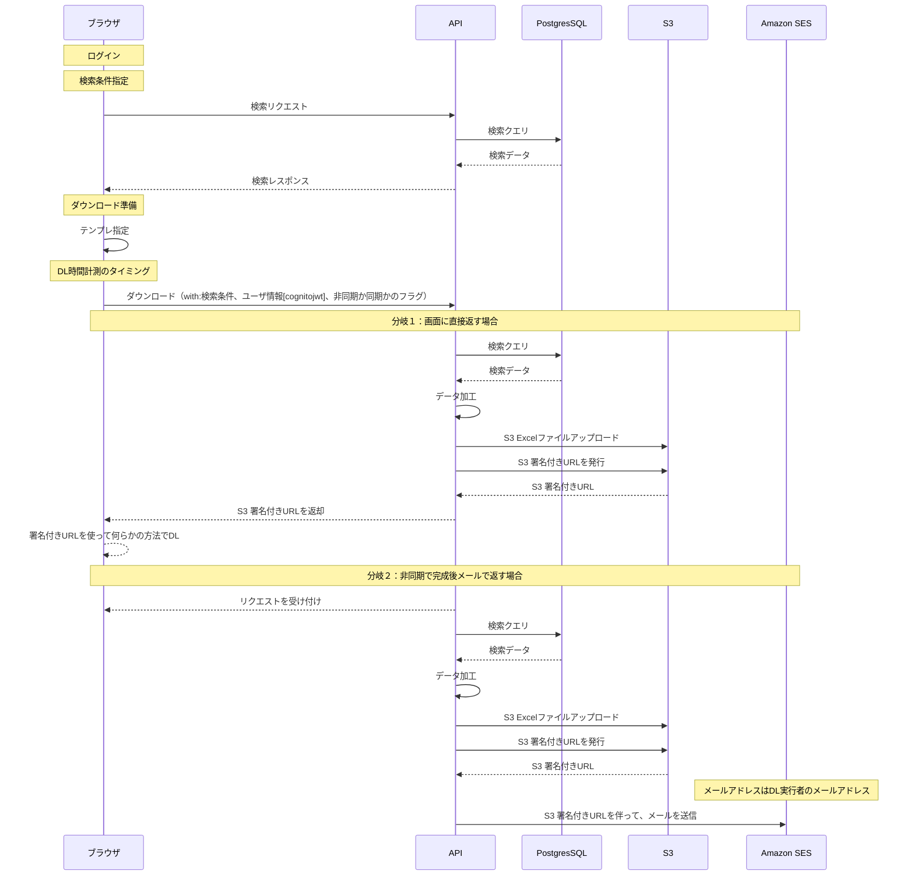

```mermaid 
sequenceDiagram
participant A as ブラウザ
participant B as API
participant C as PostgresSQL
participant D as S3
participant E as Amazon SES
Note over A: ログイン
Note over A: 検索条件指定
A->>B: 検索リクエスト
B->>C: 検索クエリ
C-->>B: 検索データ
B-->>A: 検索レスポンス
Note over A: ダウンロード準備
A->>A: テンプレ指定
Note over A: DL時間計測のタイミング
A->>B: ダウンロード（with:検索条件、ユーザ情報[cognitojwt]、非同期か同期かのフラグ）

Note over A, E: 分岐１：画面に直接返す場合
B->>C: 検索クエリ
C-->>B: 検索データ
B->>B: データ加工
B->>D: S3 Excelファイルアップロード
B->>D: S3 署名付きURLを発行
D-->>B: S3 署名付きURL
B-->>A: S3 署名付きURLを返却
A-->>A: 署名付きURLを使って何らかの方法でDL

Note over A, E: 分岐２：非同期で完成後メールで返す場合
B-->>A: リクエストを受け付け
B->>C: 検索クエリ
C-->>B: 検索データ
B->>B: データ加工
B->>D: S3 Excelファイルアップロード
B->>D: S3 署名付きURLを発行
D-->>B: S3 署名付きURL
Note over E: メールアドレスはDL実行者のメールアドレス
B->>E: S3 署名付きURLを伴って、メールを送信


```